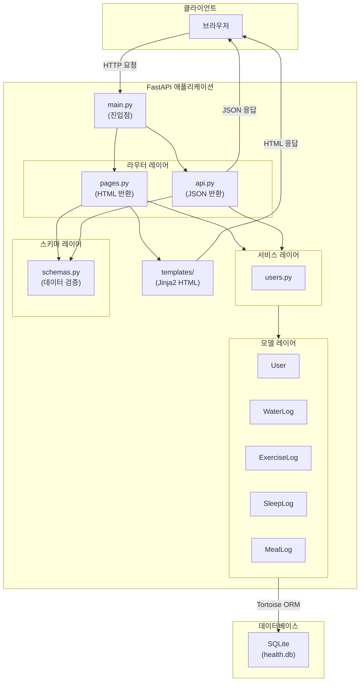
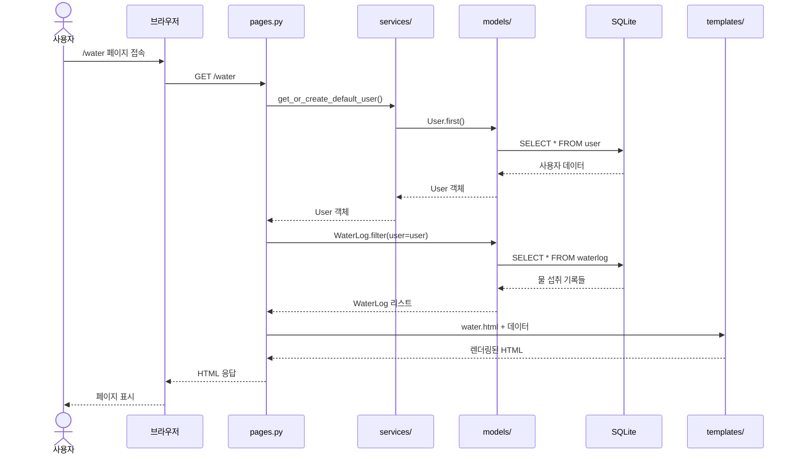
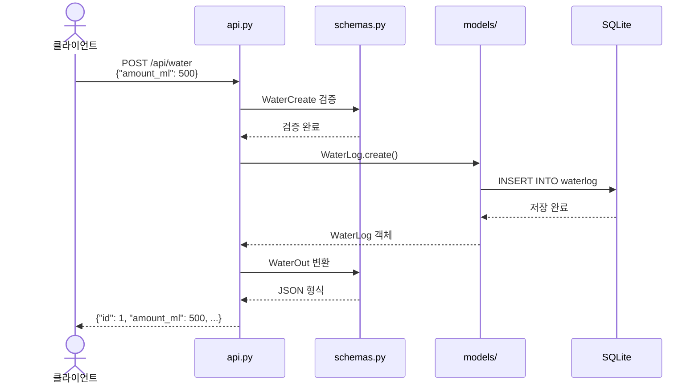
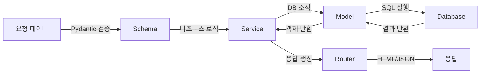

# 건강관리 실습 프로젝트 (FastAPI + Jinja + SQLite + Tortoise)

강의 실습용으로 준비된 프로젝트입니다. `complete`는 전체 완성본, `practice`는 일부 백엔드 코드가 미완성인 실습용입니다. 프론트엔드는 두 프로젝트 모두 완성된 형태입니다.


## 요구 사항
- Python 3.12
- 가상환경 사용 권장

## 실행 방법 (공통)
```bash
python -m venv .venv
source .venv/bin/activate
pip install -r requirements.txt
uvicorn app.main:app --reload
```

## 폴더 구성
- `complete/`: 전체 완성 코드
- `practice/`: 실습용 코드 (일부 ORM/백엔드 로직 미완성)

각 폴더에 들어가 실행하세요.

```bash
cd complete
pip install -r requirements.txt
uvicorn app.main:app --reload
```

```bash
cd practice
pip install -r requirements.txt
uvicorn app.main:app --reload
```

---

## 프로젝트 구조 이해하기

### 디렉토리 구조

```
app/
├── main.py          # 앱 진입점 (FastAPI 인스턴스 생성)
├── db.py            # 데이터베이스 연결 설정
├── schemas.py       # 데이터 검증 스키마 (Pydantic)
├── models/          # 데이터베이스 테이블 정의 (ORM)
│   ├── user.py
│   ├── water.py
│   ├── exercise.py
│   ├── sleep.py
│   └── meal.py
├── routers/         # URL 라우팅 (요청 처리)
│   ├── pages.py     # HTML 페이지 라우터
│   └── api.py       # REST API 라우터
├── services/        # 비즈니스 로직
├── templates/       # HTML 템플릿 (Jinja2)
└── static/          # 정적 파일 (CSS, 이미지)
```

### 각 레이어의 역할

| 레이어 | 파일 | 역할 | 비유 |
|--------|------|------|------|
| **진입점** | `main.py` | 앱 시작, 라우터 등록, DB 연결 | 건물의 정문 |
| **라우터** | `routers/` | URL과 함수 연결, 요청/응답 처리 | 안내 데스크 |
| **서비스** | `services/` | 재사용 가능한 비즈니스 로직 | 업무 담당자 |
| **스키마** | `schemas.py` | 데이터 형식 검증 | 서류 양식 검토 |
| **모델** | `models/` | DB 테이블 구조 정의 | 서류 보관함 구조 |
| **DB 설정** | `db.py` | 데이터베이스 연결 관리 | 보관함 열쇠 |

### 라우터(Routers) 상세 설명

라우터는 **"어떤 URL로 요청이 오면 어떤 함수를 실행할지"** 정의합니다.

#### 1. `pages.py` - 페이지 라우터
브라우저에서 직접 접근하는 URL을 처리하고, **HTML 페이지를 반환**합니다.

```python
@router.get("/water")
async def water_page(request: Request):
    # 물 섭취 기록 페이지를 HTML로 렌더링해서 반환
    return templates.TemplateResponse("water.html", {...})
```

#### 2. `api.py` - REST API 라우터
프로그램 간 통신용 엔드포인트로, **JSON 데이터를 반환**합니다.

```python
@router.get("/water", response_model=list[WaterOut])
async def list_water():
    # 물 섭취 기록을 JSON 형태로 반환
    return await WaterLog.all()
```

#### 라우터 분리 기준

| 현재 구조 (소규모) | 분리 구조 (대규모) |
|-------------------|-------------------|
| `api.py` - 모든 API | `water.py` - 물 관련 |
| `pages.py` - 모든 페이지 | `meal.py` - 식사 관련 |
| | `exercise.py` - 운동 관련 |

> 코드가 300줄 이상이거나, 도메인별 엔드포인트가 5개 이상이면 분리를 고려하세요.

---

## 요청/응답 흐름

### 전체 아키텍처



### 페이지 요청 흐름 (HTML)

사용자가 브라우저에서 `/water` 페이지에 접속할 때:



### API 요청 흐름 (JSON)

프로그램에서 `/api/water`로 데이터를 요청할 때:



### 데이터 흐름 요약



---

## 실습 가이드 (practice)

### 완성된 부분
- `WaterLog` 관련 ORM/라우팅은 완성되어 있습니다.
- 프론트엔드(templates, static)는 모두 완성되어 있습니다.

### 실습할 부분
- `Exercise`, `Meal`, `Sleep` 영역의 TODO 주석을 참고해 ORM 및 API를 완성하세요.
- 백엔드가 연결되면 프론트엔드는 바로 동작합니다.

### 실습 순서
1. `models/` - 모델 정의 확인
2. `db.py` - 모델 등록 (TODO 부분)
3. `routers/pages.py` - 라우터 함수 완성 (TODO 부분)
4. `routers/api.py` - API 엔드포인트 완성 (TODO 부분)

### 참고
- `/report` 페이지는 pandas + matplotlib 예시입니다.
- `complete/` 폴더의 코드를 참고하세요.
